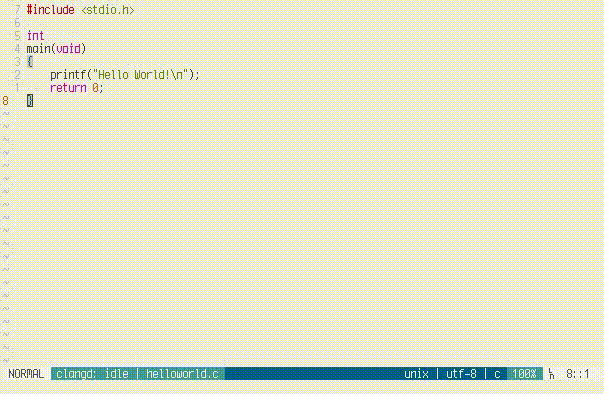

# Simple Togglable Terminal



This plugin aims to add a basic togglable terminal to neovim (and partially vim), to make 
it more "IDE like".

## Commands

You can toggle stt with the command:

```
:ToggleTerm
```

Or if you want to have multiple terminals you can execute `:ToggleTerm` with an
argument:

```
:ToggleTerm term-1
```

And now `:ToggleTerm term-1` will only toggle term-1.

## Configuration

The configurations only works in neovim, with vim they are ineffective.

You can enable `g:stt_auto_insert` to automatically enter insert mode when
entering a terminal.

```
let g:stt_auto_insert = 1
```

By enabling `g:stt_auto_quit` the terminal window will quit, when there is no other window.

```
let g:stt_auto_quit = 1
```

### If you have enchantments ideas or issues, feel free to open a issue/pr

### Vim has to be compiled with terminal support to (partially) work

This plugin is still a work in process, vim support is close to none, and there
is still somethings I plan to implement on it. Everyday I try to work a little on it.
